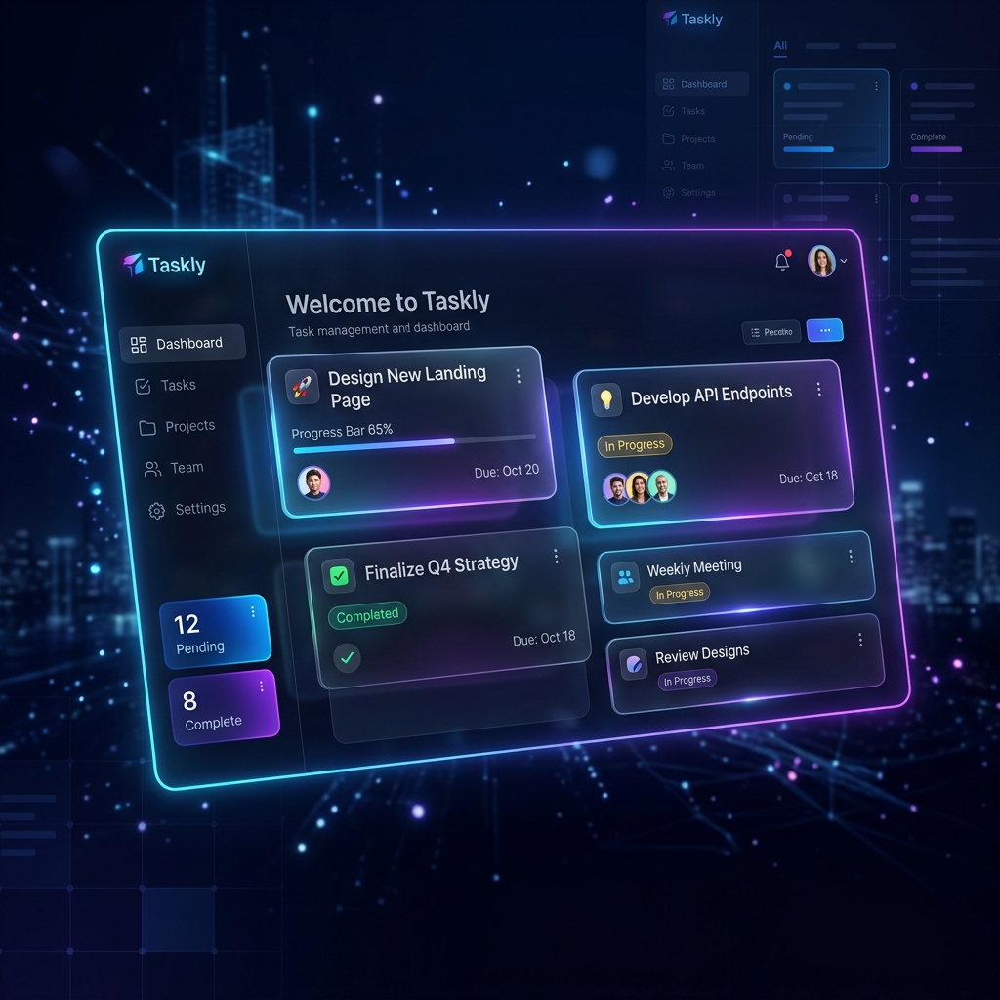

<div align="center">
  

  # 🚀 Taskly — Team Task Manager

  [](https://opensource.org/licenses/MIT)
  [](https://reactjs.org/)
  [](https://nodejs.org/)
  [](https://www.mongodb.com/)
  [](https://tailwindcss.com/)

  **The ultimate full-stack solution for modern team collaboration and real-time task management.**
</div>

---

## 🌟 Overview

Taskly is a premium, high-performance task management application built for teams that value speed and efficiency. With a robust **Role-Based Access Control (RBAC)** system, Taskly ensures that project managers and team members stay synchronized in a beautiful, responsive environment.

<div align="center">
  
</div>

---

## ✨ Key Features

- 🔐 **Secure Authentication**: Enterprise-grade JWT-based authentication with Bcrypt hashing.
- 👥 **Role-Based Access Control (RBAC)**:
  - **Admin**: Oversee projects, manage team members, and assign high-priority tasks.
  - **Member**: Track assigned tasks and update progress in real-time.
- 📁 **Project Scoping**: Organize work by projects for better focus and resource allocation.
- 📊 **Intelligent Dashboard**:
  - Live status tracking (Pending, In Progress, Completed).
  - 🔥 **Smart Alerts**: Never miss a deadline with automated overdue task detection.
- 🌓 **Premium Dark Mode**: A sleek, eye-pleasing dark theme built with Tailwind CSS v4.
- 📱 **Adaptive UI**: Seamless experience across mobile, tablet, and ultra-wide desktops.
- 🚂 **Cloud Ready**: Optimized for single-click deployment on platforms like Railway.

---

## 🛠️ Tech Stack

| Frontend | Backend | Database | Deployment |
| :--- | :--- | :--- | :--- |
| **React (Vite)** | **Node.js** | **MongoDB** | **Railway** |
| Tailwind CSS v4 | Express.js | Mongoose | Vercel / Render |
| Lucide Icons | JWT / Bcrypt | Atlas | |

---

## 🚀 Getting Started

### 1. Prerequisites
- [Node.js](https://nodejs.org/) (LTS version recommended)
- [MongoDB Atlas](https://www.mongodb.com/cloud/atlas) Account

### 2. Environment Configuration
Create a `.env` file in the `backend` directory:
```env
MONGO_URL=your_mongodb_connection_string
PORT=5000
JWT_SECRET=your_secret_key
```

### 3. Installation
Get up and running with a single command:
```bash
npm run install-all
```

### 4. Initialize Admin Account
Seed the database with an initial administrator account:
```bash
cd backend
node seedAdmin.js
```
> [!NOTE]
> **Default Admin Credentials:**
> - **Email**: `administrator@taskly.com`
> - **Password**: `Navdivsa.,123%`

### 5. Launch Development Servers
**Start the Engine:**
```bash
# In backend/
node server.js

# In frontend/
npm run dev
```

---

## 🚂 Deployment

This project is pre-configured for seamless deployment on **Railway**.

1. **Fork/Clone** the repository.
2. **Connect** to Railway via the dashboard.
3. **Configure** environment variables (`MONGO_URL`, `JWT_SECRET`).
4. **Deploy** — Taskly will handle the build and startup automatically.

---

<div align="center">
  Built with ❤️ for productive teams.
  <br>
  Released under the [MIT License](LICENSE).
</div>
